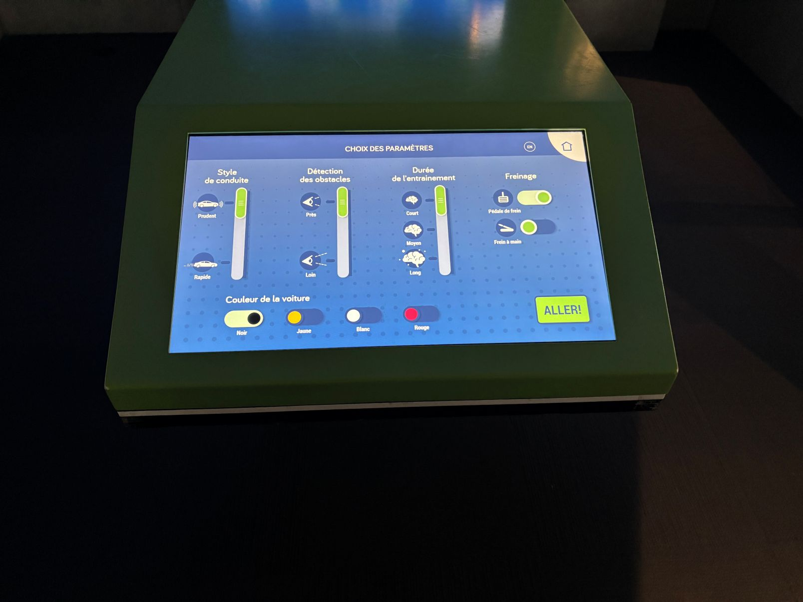

# MON EXPÉRIENCE À L'EXPOSITION EXPLORE AU CENTRE DES SCIENCES DE MONTRÉAL

> **Moi devant l'exposition « Explore », située au Centre des sciences de Montréal, 2 rue de la Commune Ouest, Montréal, QC H2Y 4B2, Canada.** (Photos prises par Alicia, le 17 avril 2026.)

---

# L'EXPOSITION ET SON CONTEXTE

L'exposition permanente « Explore » du Centre des sciences de Montréal présente au public les grandes avancées technologiques de notre époque. Parmi les thématiques abordées, la voiture intelligente occupe une place centrale. Cette section de l'exposition invite les visiteurs à découvrir comment les nouvelles technologies transforment nos modes de déplacement, notamment grâce à l'intelligence artificielle, aux capteurs embarqués dans les voiture dernière génération. L'exposition propose une réflexion sur la negligence au volant et sur l'impact de ces innovations sur notre vie quotidienne.

> **Le panneau d'introduction à la section « Voiture intelligente » de l'exposition Explore.** (Photos prises par moi, le 17 avril 2026.)

---

# LA VOITURE INTELLIGENTE : QU'EST-CE QUE C'EST ?

La voiture intelligente, aussi appelée véhicule autonome ou connecté, est un véhicule capable de percevoir son environnement et de prendre des décisions de conduite de manière automatisée, sans intervention humaine ou avec une intervention minimale. Elle repose sur une combinaison de technologies de pointe : l'intelligence artificielle, les capteurs (caméras, radars), le traitement des données en temps réel et la communication entre véhicules et infrastructures. 

> **l'écran de controle.** (Photos prises par moi, le 17 avril 2026.)

---

# COMPOSANTES PRÉSENTÉES DANS L'EXPOSITION

**Les capteurs et la perception de l'environnement :**
L'exposition nous montre comment la voiture intelligente « voit » le monde qui l'entoure grâce à un réseau de capteurs. Des caméras, des radars et des lidars permettent au véhicule de détecter les obstacles, les piétons, les panneaux de signalisation et les autres véhicules, même dans des conditions météorologiques difficiles.

**La simulation de conduite autonome :**
Un simulateur interactif permet aux visiteurs d'expérimenter la conduite autonome et de comprendre comment le système prend des décisions en temps réel face à différentes situations de la route.

**L'intelligence artificielle à bord :**
Des panneaux et des animations expliquent le rôle de l'intelligence artificielle dans le traitement des données collectées par les capteurs. Le visiteur découvre comment l'IA analyse des milliers d'informations par seconde pour assurer la sécurité des passagers et des usagers de la route.

**La connectivité et la mobilité de demain :**
L'exposition aborde également la communication entre les véhicules intelligents et les infrastructures urbaines (feux de circulation, panneaux, autres voitures), ouvrant la voie à des villes plus fluides et plus sécuritaires.

   
> **Ces images montrent les différentes composantes présentées dans la section voiture intelligente de l'exposition Explore.** (Photos prises par moi, le 17 avril 2026.)

---

# RÉFLEXION PERSONNELLE

Ce qui m'a le plus impressionné dans cette section de l'exposition, c'est la façon dont elle rend accessible une technologie souvent perçue comme complexe ou abstraite. Grâce aux simulations interactives et aux explications visuelles, on comprend très concrètement comment fonctionne une voiture intelligente et quels défis restent encore à relever, notamment en matière de sécurité, d'éthique et d'adaptation des infrastructures urbaines. L'exposition nous invite à nous interroger sur notre rapport à la mobilité et sur le rôle que nous souhaitons donner à la technologie dans nos villes. Une visite enrichissante et stimulante, autant pour les adultes que pour les jeunes. Une audiodescription est également disponible pour certaines installations. L'exposition Explore illustre concrètement ces principes à travers des maquettes interactives, des simulations et des panneaux explicatifs accessibles à tous les publics.. N'hésitez pas à consulter le lien suivant pour plus d'informations : <https://www.centredessciencesdemontreal.com/exposition-permanente/explore>

---

# RÉFÉRENCE

1. **<https://www.centredessciencesdemontreal.com/exposition-permanente/explore>** consulté le 17 avril 2026.
