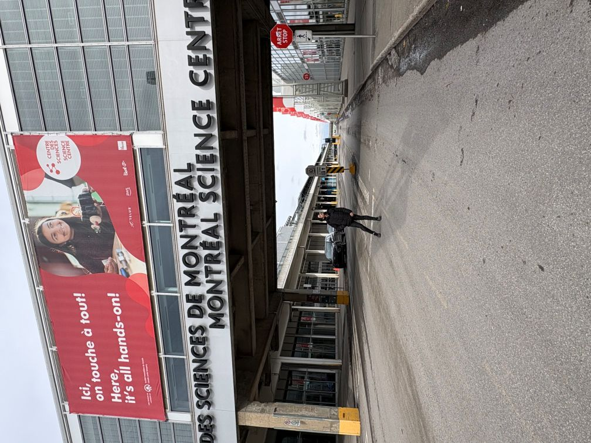
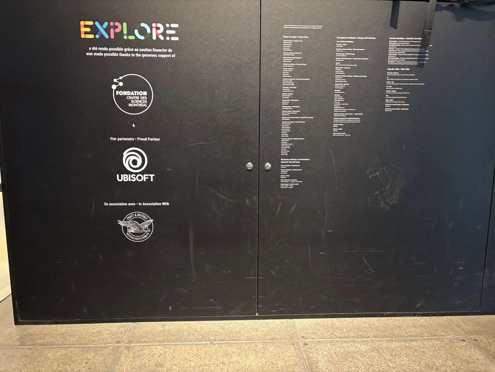
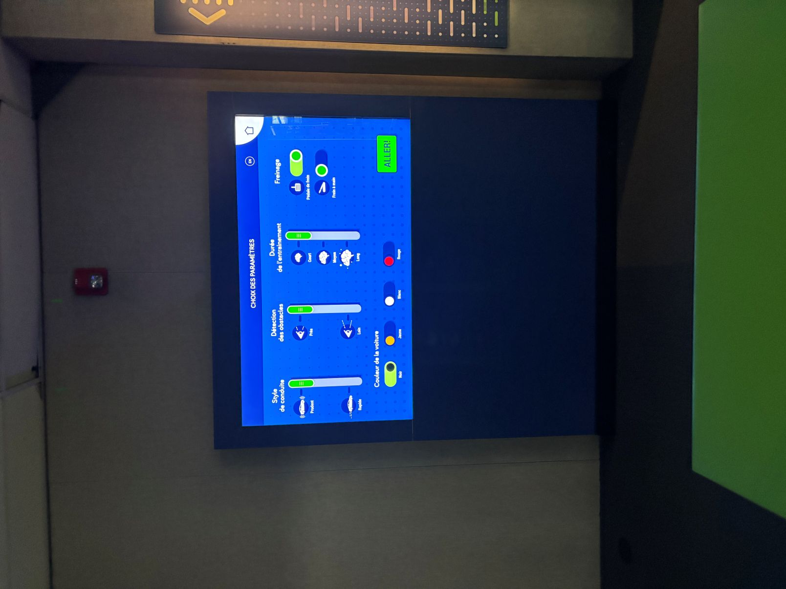
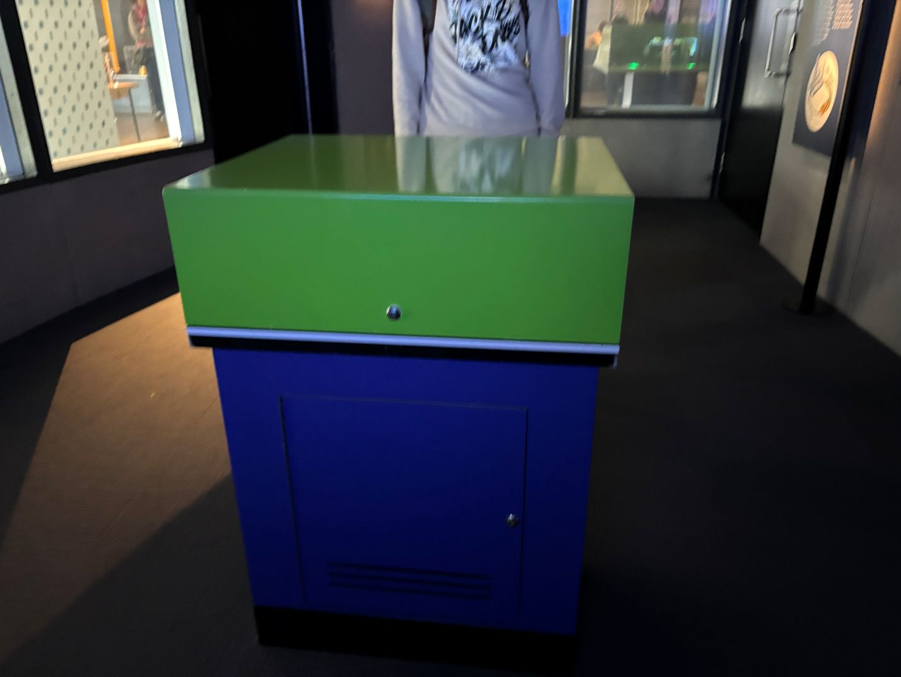

# MON EXPÉRIENCE À UNE EXPOSITION ARTISTIQUE AU MUSÉE D'ART CONTEMPORAIN DE MONTRÉAL

  
>**Moi devant l'exposition « Explore », située à Centre des Sciences de Montréal 2 rue de la Commune Ouest
Montréal, QC H2Y 4B2
Canada**. (Photos prises par Alicia, le 17 avril 2026.)

# L'EXPOSITION ET SON CONTEXTE
> L'œuvre de l'artiste Joyce Joumaa, intitulée Bêtise humaine (2025), s'inscrit dans le cadre de l'exposition collective « Éloges de l'image manquante », présentée lors de la 19e édition de la biennale MOMENTA. Ce projet de grande envergure se déploie au Musée d'art contemporain de Montréal (MAC), actuellement situé à Place Ville Marie. L'installation explore les tensions postcoloniales et la mémoire collective à travers le prisme du sport et de l'histoire. Au cœur de cette démarche, l'artiste propose une réflexion sur la psychologie sociale nationale, utilisant des archives pour mettre en lumière les silences et les non-dits des relations entre la France et l'Algérie. L'œuvre nous invite à une méditation sur la manière dont les espaces publics, comme un stade de football, deviennent des lieux de confrontation identitaire.
N'hésitez pas à vous y référer en consultant ce lien (https://momentabiennale.com/wp-content/uploads/2025/08/Signaletique-PlainText-Joumaa.pdf)

  
>**Le cartel de l'œuvre « Bêtise humaine » de Joyce Joumaa.** (Photos prises par moi,  le 1 avril 2026)

# QUI EST JOYCE JOUMAA
Joyce Joumaa est une artiste visuelle, vidéaste et autrice libano-canadienne qui vit et travaille entre Montréal, Beyrouth et Amsterdam. Sa pratique interdisciplinaire examine les structures politiques et architecturales à travers la vidéo et les archives. Elle s'intéresse particulièrement aux micro-histoires et à la politique de l'espace, cherchant à comprendre comment le passé façonne notre présent. (1)

  
>Capture d'écran du site web <https://macm.org/expositions/momenta-eloges/> consulté le 1 avril 2026 

# DESCRIPTION DE L'OEUVRE
L'œuvre de Joyce Joumaa, est une installation vidéo contemplative d'une grande puissance symbolique. Le dispositif utilise un montage video complexe juxtaposant des images d'archives du match de soccer (football) amical qui a opposé la France à l'Algérie en octobre 2001 avec des scènes du film **La Bataille d'Alger de 1966** de Gillo Pontecorvo. La dimension multimédia est ici utilisée pour créer un choc visuel et temporel : le spectateur observe l'interruption du match par les supporters alors que les images de fiction historique rappellent la lutte pour l'indépendance, créant un dialogue direct entre les souvenire de la guerre et l'invation du terain de soccer. (3)

  
>**Vue d'ensemble de la mise en espace de l'œuvre**.(Photos prises par moi,  le 1 avril 2026)

# COMPOSANTES TECHNIQUES
Le Banc :
Ce banc en métal n'est pas juste un meuble pour s'asseoir. Sa forme longue et droite rappelle les gradins d'un terrain de soccer. En proposant ce banc, l'artiste force le spectateur à s'arrêter et à prendre son temps. C'est une invitation qui permet au spectateur de se sentir comme dans un terrain de soccer.

Un projecteur :
Il permet de visionner le match France VS Algérie et les moments de la guerre d'indépendance algérienne.

Les Haut-parleurs et la Spatialisation :
Le son est souvent diffusé de manière directionnelle. Les haut-parleurs ne sont pas cachés ; ils font partie de l'esthétique de l'œuvre. Ils diffusent les voix off et les sons d'ambiance du site de Tripoli, créant une bulle sonore qui isole le spectateur du reste de la galerie.

       
>**Ces images montre les composent de l'oeuvre dede Joyce Joumaa**. (Photos prises par moi, le 1 avril 2026.)

# RÉFLEXION PERSONNELLE
Ce qui m'a le plus impressionné dans le travail de Joyce Joumaa, ce sont les vidéos et les installations, on a l'impression que le temps est "bloqué". C'est une réflexion sur l'échec politique : quand les dirigeants se battent ou abandonnent des projets, ce sont des quartiers entiers et des vies qui s'arrêtent de progresser. Son œuvre nous force à regarder ce "temps mort" que l'on essaie d'habitude d'ignorer. L'artiste ne se contente pas de projeter un film ; elle crée une histoire qui raconte un moment historique perdu. On aver aussi le droit a une version on audio d'escription. N'hésitez pas à vous y référer en consultant ce lien (https://momenta.macm.org/fr/2.html)

# REFERENCE
1)**<https://www.centredessciencesdemontreal.com/exposition-permanente/explore>** consulté le 17 avril 2026. 
2)**<[https://macm.org/expositions/momenta-eloges/](https://momentabiennale.com/exhibit/betise-humaine/)>** consulté le 17 avril 2026. 
3)**<[https://macm.org/expositions/momenta-eloges/](https://momentabiennale.com/wp-content/uploads/2025/08/Signaletique-PlainText-Joumaa.pdf)>** consulté le 17 avril 2026. 
