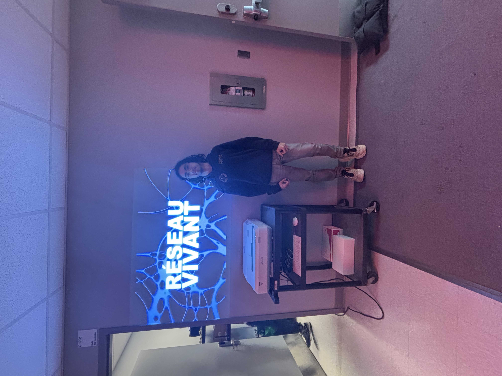
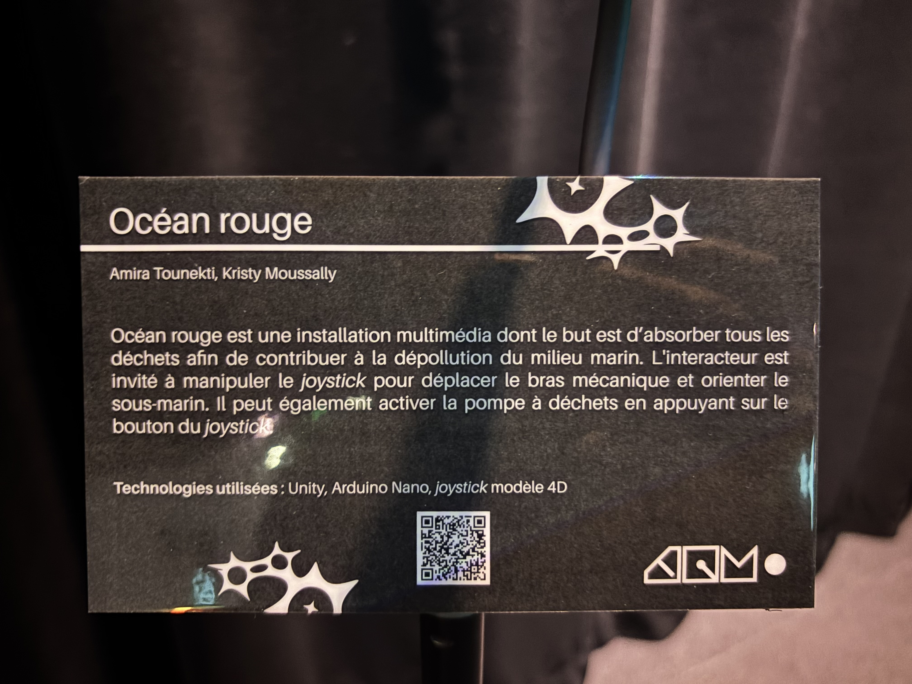
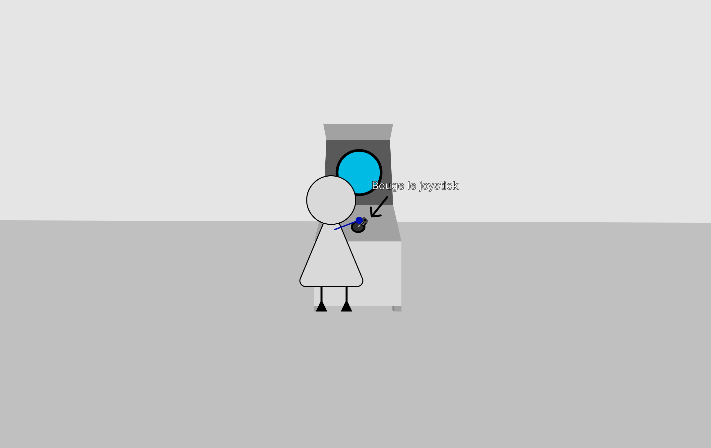

# MON EXPÉRIENCE À L'EXPOSITION « RÉSEAU VIVANT » AU STUDIO TIM

> **Moi devant l'exposition « Réseau vivant », située au Studio TIM du Cégep Montmorency.** (Photo prise par Alicia Castilloux, le 16 mars 2026.)

# L'EXPOSITION ET SON CONTEXTE

L'exposition « Réseau vivant » est présentée au Studio TIM du Cégep Montmorency. Elle rassemble plusieurs installations multimédia conçues et réalisées par des étudiants du programme de Techniques d'intégration multimédia (TIM). Parmi les œuvres exposées, c'est le projet **Océan Rouge** qui a particulièrement retenu mon attention.

Il s'agit d'une installation multimédia dont le but est de créer un mouvement collectif engendrant des changements positifs pour l'ensemble des êtres vivants. À travers ce projet, les étudiants du programme TIM souhaitent sensibiliser le public à la pollution marine et lui faire vivre la sensation de participer activement à un mouvement de sauvetage des océans. (1)

> **Le cartel de l'œuvre « Océan Rouge ».** (Photo prise par moi, le 16 mars 2026.)

# DESCRIPTION DE L'ŒUVRE

**Océan Rouge** est une installation immersive qui plonge le visiteur dans un univers marin menacé par la pollution. L'œuvre joue sur la participation collective : chaque visiteur devient un acteur du changement, contribuant par ses actions à un mouvement de sauvegarde de l'environnement marin. L'installation utilise des projections visuelles, une ambiance sonore et des interactions numériques pour créer une expérience sensorielle forte et engagée.

Le titre « Océan Rouge » évoque à la fois la menace qui pèse sur les écosystèmes marins et l'urgence d'agir collectivement. La couleur rouge, associée au danger et à l'alerte, contraste avec l'imaginaire habituel de l'océan bleu et paisible, soulignant ainsi la gravité de la situation environnementale. voici une image demestratife 

> **L’interacteur manipule le joystick, qui modifie la position de la pompe à déchets et active le bras mécanique.** (Photo prise par https://deux-intelligence.github.io/deux-neurones/#/concept/, le 1 mai 2026. lien du site dans la reference ) 

# COMPOSANTES TECHNIQUES

**Les projections visuelles :**
L'installation s'appuie sur des projections immersives qui enveloppent le visiteur dans des images de l'océan, alternant entre des séquences évoquant la beauté des fonds marins et d'autres illustrant les ravages de la pollution. Ces projections créent un choc visuel efficace qui interpelle le spectateur.

**L'ambiance sonore :**
Un environnement sonore soigneusement composé accompagne les projections. Les sons de l'océan, des vagues et de la vie marine sont progressivement altérés par des bruits associés à la pollution, renforçant l'impact émotionnel de l'installation.

**L'interaction numérique :**
L'aspect interactif de l'œuvre est au cœur de la démarche des créateurs. Le visiteur n'est pas simple spectateur : il est invité à interagir avec l'installation, symbolisant ainsi sa participation au mouvement collectif de protection des océans.

# RÉFLEXION PERSONNELLE

Ce qui m'a le plus touché dans **Océan Rouge**, c'est la façon dont l'installation transforme le visiteur en acteur plutôt qu'en simple observateur. En créant ce sentiment d'appartenance à un mouvement collectif, les étudiants réussissent à rendre la cause environnementale plus concrète et plus proche de chacun. L'expérience est à la fois belle et troublante : on ressort de l'installation avec une prise de conscience réelle sur l'urgence de protéger nos océans. C'est un très beau travail de la part des étudiants TIM, qui prouve que le multimédia peut être un puissant outil de sensibilisation.

# RÉFÉRENCE

1. **<https://deux-intelligence.github.io/deux-neurones/#/>** consulté le 16 mars 2026.
