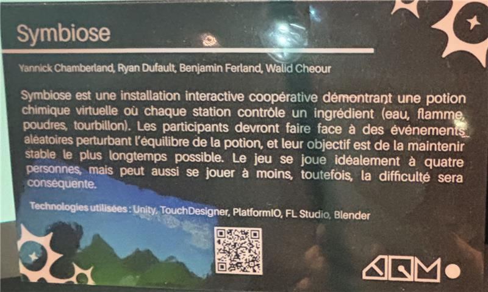
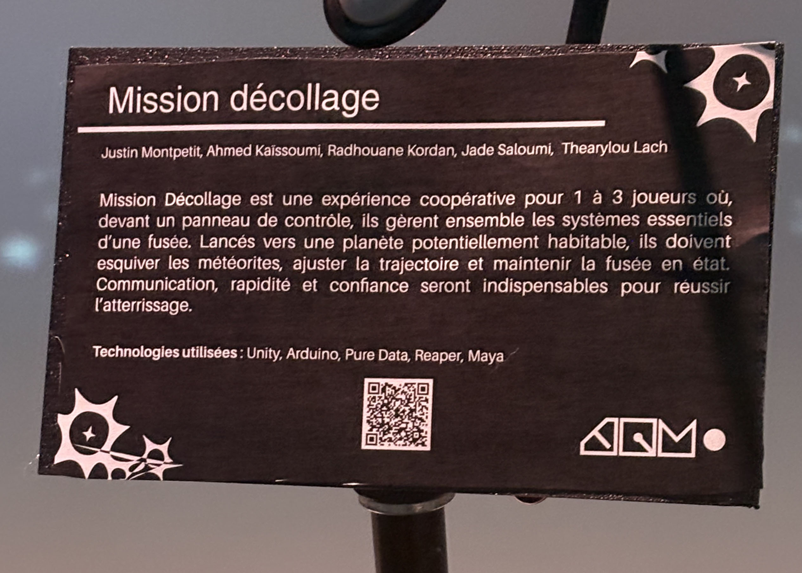
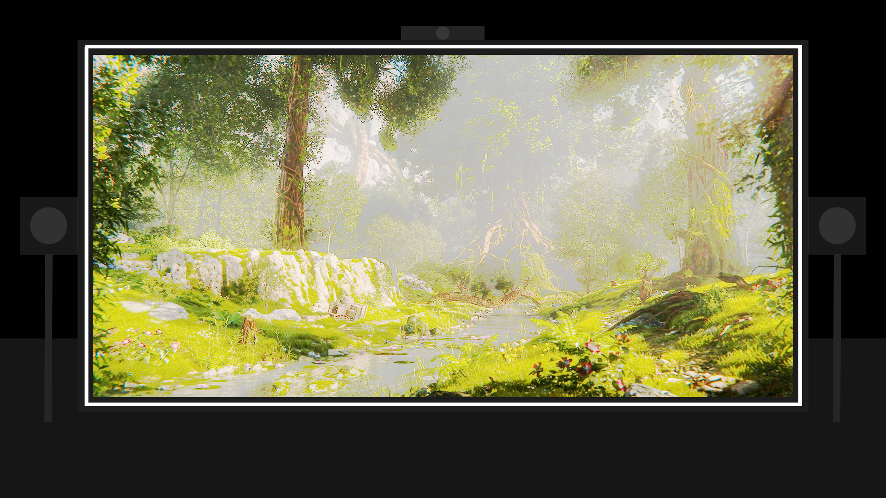

# MON ORDRE DE PRÉFÉRENCE POUR LES PROJET TIM
1) Océan rouge
2) Symbiose
3) Terminal
4) Arbre-en-face
5) Mission Décollage
6) Quand les yeux se croisent

# Titre du projet ET Noms des créateurs et créatrices
# Océan rouge = **Amira Tounekti et Kristy Moussally**   
# Symbiose = **Yannick Chamberland, Benjamin Ferland, Ryan Dufault et Walid Cheour**    
# Terminal = **Émeryk Bélisle, Elie Daher, Ting Yung Lu Terry, Dana Saavedra-Torrano et Mégane Ranger**  
# Arbre-en-face = **Alexandre Gendron, Mikael Arseneau, Mathieu Willett, Matis Ghariani et Rafael Angon Dube** 
# Mission Décollage = **Ahmed Kaissoumi, Radhouane Kordan, Justin Montpetit, Thearylou Lach et Jad Saloumi**  
# Quand les yeux se croisent = **Edelwyn Ledru, Félix Lavoie, Jade Hébert, Manel Yaya et Patricia Nassif** 

# MA RÉFLEXION PERSONNELLE SUR L'EXPO TIM
J'ai aimer l projet Océan rouge de  Amira Tounekti et Kristy Moussally parce que sa rapelle des jeux d'arcade et en plus d'inssité les gens à netoyer les océon il le fond avec un univerret de jeux 

 
 
 
 
 

