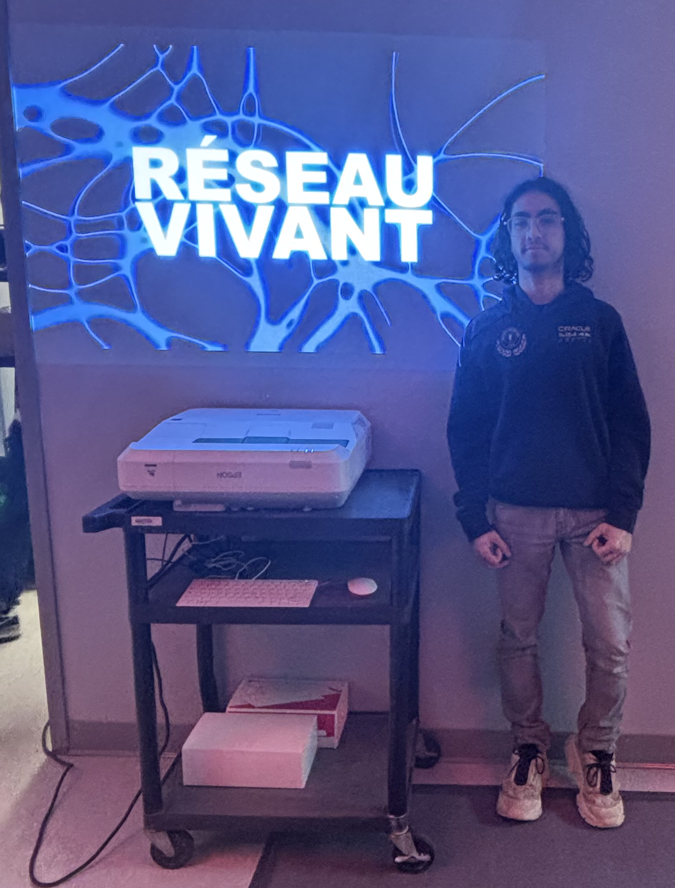

# MON EXPÉRIENCE À l'EXPOSITION Réseau vivant au studio TIM 

  
>**Moi devant l'exposition « Réseau vivant », située au studio TIM du cegep Momontrency .** (Photo prise par Alicia Castilloux, le 16 mars 2026.)

https://deux-intelligence.github.io/deux-neurones/#/
