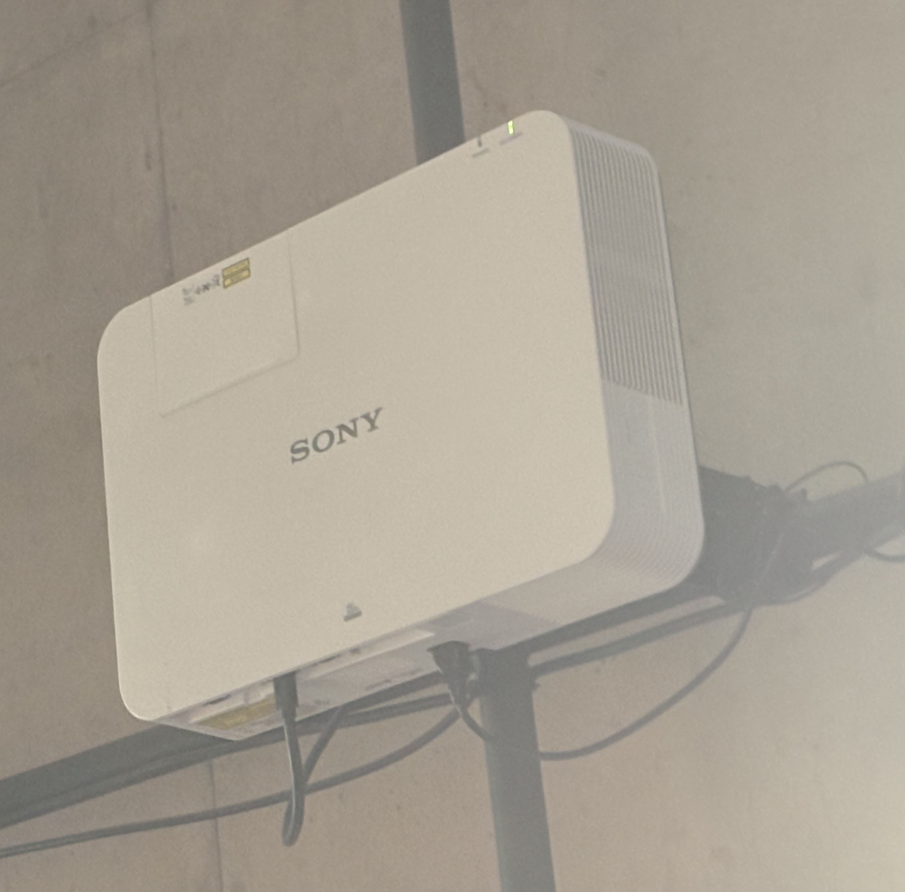
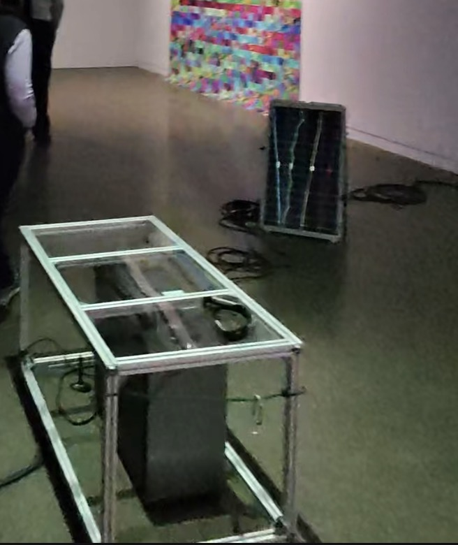

# MON EXPÉRIENCE À UNE EXPOSITION ARTISTIQUE À LA GALERIE DE L'UNIVERSITÉ DE MONTRÉAL

  
>Moi devant l'exposition « Pratiques de l'IA », située à la Galerie de l'Université de Montréal. (Photo prise par Alicia Castilloux, le 30 janvier 2026.)

# L'EXPOSITION ET SON CONTEXTE
L'œuvre de l'artiste Marion Schneider, intitulée Terre commune, s'inscrit dans le cadre de l'exposition collective Devenirs partagés. Pratiques de l'IA en 2025. Ce projet découle d'une résidence de recherche-création à la Galerie de l'Université de Montréal, réalisée en collaboration avec IVADO. L'installation explore les points de contact entre la cognition humaine, l'intelligence artificielle (IA) et les écosystèmes naturels. Au cœur de cette démarche, l'artiste propose une réflexion sur la technologie comme « partenaire de soin », favorisant une coexistence harmonieuse entre les humains, les machines et les forêts. L'œuvre nous invite à une méditation sur nos interdépendances, s'éloignant des visions purement automatisées de l'IA pour privilégier une approche sensible.

   
>Le cartel de l'œuvre « Terre commune » et l'affiche de l'exposition à la Galerie de l'Université de Montréal. (Photos prises par Alicia Castilloux, le 30 janvier 2026.)

# DESCRIPTION DE L'OEUVRE
L'œuvre est une installation immersive et interactive d'une grande complexité technique. Le dispositif utilise une IA générative entraînée à partir de photographies de sols forestiers captées par l'artiste dans les Laurentides. La dimension multimédia est ici centrale : le public est invité à porter un casque EEG (électroencéphalographie). L'activité cérébrale du visiteur — plus précisément les ondes alpha liées à la relaxation — influence en temps réel la génération des visuels projetés, créant un dialogue direct entre l'esprit et l'image.

 
>Vue d'ensemble de la mise en espace de l'œuvre. (Photo prise par Alicia Castilloux, le 30 janvier 2026.)

# COMPOSANTES TECHNIQUES ET croquis
Sur le plan technique, l'installation regroupe plusieurs éléments sophistiqués :
Matériel : Ordinateur, casque EEG, extrusions d'aluminium, acrylique et écrans dénudés.
Logiciels et IA : Utilisation du modèle StyleGAN pour la navigation dans l'espace latent et de ressources comme Autolume et TouchDesigner.
Interaction : Une navigation en temps réel basée sur les données EEG collectées sur place.
Gros plan sur les structures d'aluminium et les composantes qui soutiennent ce dispositif technologique unique.

   
>Ces images montre les composent et le croquis de l'oeuvre de Marion Schneider. (image du projecteure prise par Alicia Castilloux le 30 Jenvier 2026.)

# RÉFLEXION PERSONNELLE
Ce qui m'a le plus impressionné dans le travail de Marion Schneider, c'est cette idée de "co-ancrage" entre l'humain, la machine et la forêt. L'expérience de voir ses propres ondes cérébrales influencer des images de nature générées par IA est fascinante et donne beaucoup d'idées pour l'utilisation des bioscapteurs en création multimédia. L'aspect que je retiendrais comme défi pour de futurs projets est la complexité de calibrer un casque EEG dans un environnement public pour s'assurer que l'interactivité reste fluide pour chaque visiteur.

Ammar Mrini
