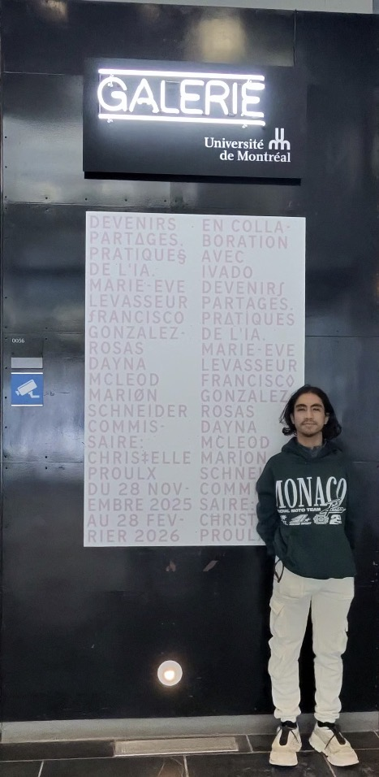
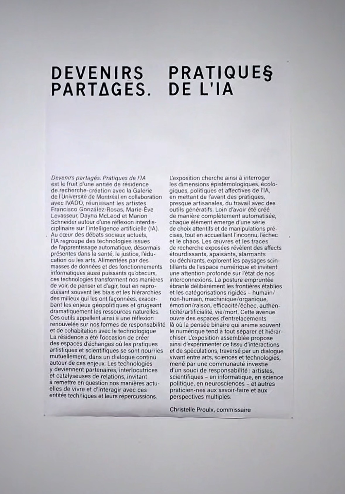

# MON EXPÉRIENCE À UNE EXPOSITION ARTISTIQUE À LA GALERIE DE L'UNIVERSITÉ DE MONTRÉAL

  
>Cette image de moi devant l'exposition pratiques de l'IA, située à la Galerie de l'Université de Montréal.

# L'EXPOSITION ET SON CONTEXTE
L'œuvre de l'artiste Marion Schneider, intitulée Terre commune, s'inscrit dans le cadre de l'exposition collective Devenirs partagés. Pratiques de l'IA. Ce projet est le fruit d'une résidence de recherche-création à la Galerie de l'Université de Montréal, en collaboration avec IVADO. L'installation explore les zones de contact entre la cognition humaine, l'intelligence artificielle (IA) et les mondes naturels.
Au cœur de cette démarche, l'artiste propose une réflexion sur la manière dont la technologie peut devenir un « partenaire de soin » en favorisant une coexistence apaisée entre les êtres humains, les machines et les forêts. L'œuvre nous invite ainsi à une méditation profonde sur nos interdépendances, loin des visions purement automatisées de l'IA.

   
>Ces image du cartel de L'œuvre de l'artiste Marion Schneider, intitulée Terre commune et Laffiche de l'exposition, située à la Galerie de l'Université de Montréal.  (image prise par Alicia Castilloux)

# DESCRIPTION DE L'OEUVRE
L'œuvre est une installation immersive et interactive d'une grande complexité technique. Le dispositif utilise une IA générative entraînée à partir d'images de sols forestiers collectées par l'artiste lors de balades dans les Laurentides. La fonction multimédia est ici centrale : le public est invité à porter un casque EEG (électroencéphalographie). L'activité cérébrale du visiteur, plus précisément les ondes alpha associées au sommeil et à la méditation, influence en temps réel la génération des visuels projetés.

 
>Cette image de L'œuvre montre l'ensemble de la mise en espace. (image prise par Alicia Castilloux)

# COMPOSANTES TECHNIQUES ET EXPÉRIENCE VÉCUE
Sur le plan technique, l'installation regroupe plusieurs éléments sophistiqués :
Matériel : Ordinateur, casque EEG, extrusions d'aluminium, acrylique et écrans dénudés.
Logiciels et IA : Utilisation du modèle StyleGAN pour la navigation dans l'espace latent et de ressources comme Autolume et TouchDesigner.
Interaction : Une navigation en temps réel basée sur les données EEG collectées sur place.
Gros plan sur les structures d'aluminium et les composantes qui soutiennent ce dispositif technologique unique.

# RÉFLEXION PERSONNELLE
Ce qui m'a le plus impressionné dans le travail de Marion Schneider, c'est cette idée de "co-ancrage" entre l'humain, la machine et la forêt. L'expérience de voir ses propres ondes cérébrales influencer des images de nature générées par IA est fascinante et donne beaucoup d'idées pour l'utilisation des bioscapteurs en création multimédia. L'aspect que je retiendrais comme défi pour de futurs projets est la complexité de calibrer un casque EEG dans un environnement public pour s'assurer que l'interactivité reste fluide pour chaque visiteur.
