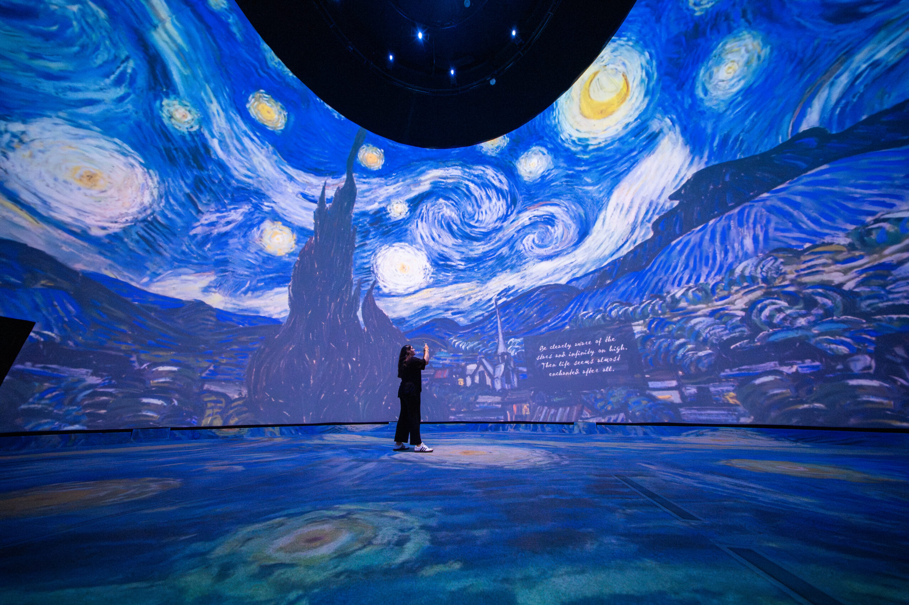
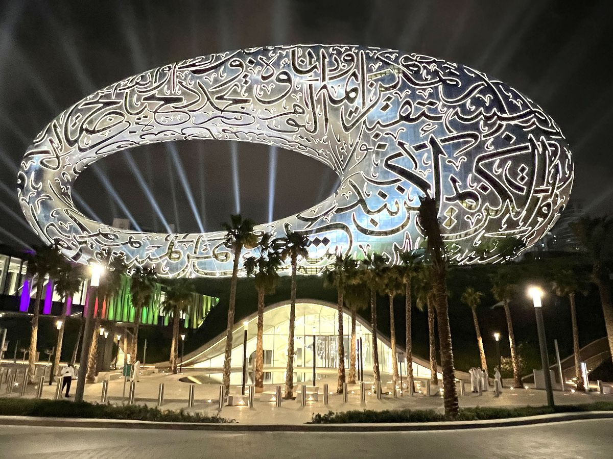

# Ammar Mrini

>Cette image me represente pour son coté abstrée et calm d'écran du site web https://thedali.org/exhibit/van-gogh-alive-360-exhibit/, consulté le 23 janvier 2026.

## **Intérêts dans le multimedia**
J'aime les oeuvres d'art et en particulier le numérique qui utilise les codes ( html,css,JS code,etc.) et les outils technologiques pour en crée une histoire de sons et d'images.  Je souhaite vous faire découvre cette art atravere mes oeuvre.

>Capture d'écran du site web https://www.lesnumeriques.com/vie-du-net/musee-du-futur-de-dubai-une-vitrine-pour-les-innovations-technologiques-de-demain-n177509.html, consulté le 23 janvier 2026.
