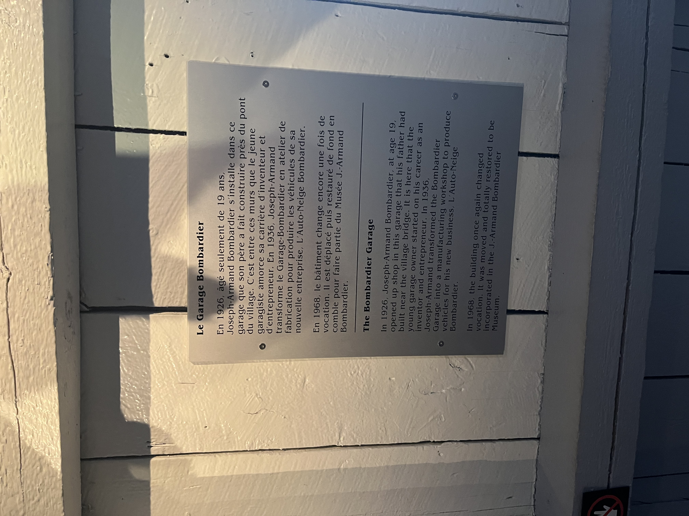
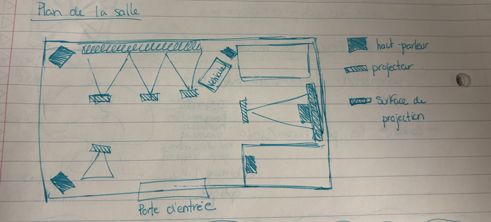

## Compte-rendu de conférence  MUSÉE DE L'INGÉNIOSITÉ avec Martin Bouché

### Introduction

Le technicien M. Boucher, employé au Musée de l'ingéniosité J.-Armand Bombardier de Valcourt, a présenté une conférence portant sur son métier et sur les dispositifs multimédias qui composent les installations permanentes du musée. La conférence s'est déroulée sous forme d'un tour de table interactif, débutant par une question brise-glace : « Qui êtes-vous, et avez-vous déjà côtoyé des dispositifs multimédias ? »

---

### Développement

M. Boucher a d'abord décrit son rôle polyvalent au sein du musée : il assure la sonorisation, réalise des productions photo et vidéo publicitaires, répare les ordinateurs et connaît les fils par la voie de l'audio et de la vidéo. Ce profil technique touche à plusieurs domaines, notamment l'électricité, l'informatique (programmation, production audiovisuelle, interface entre groupe et appareil), l'éclairage DMX et optique, ainsi que l'audio, le MIDI, le mixage sonore et l'acoustique.

Il a ensuite présenté concrètement certaines installations du musée. L'une d'elles, le **bogie du métro** (wagon de métro), est un dispositif interactif qui invite les visiteurs à trouver cinq fréquences de vibrations en jouant avec une interface dédiée. Le conférencier a également montré un dispositif inspiré d'une borne d'arcade traditionnelle, fonctionnant à l'aide d'un Arduino relié à un détecteur de mouvement, dont le logiciel interne repose sur **Max MSP/Jitter**.

M. Boucher a aussi abordé l'écosystème technologique utilisé au musée : les logiciels audio (Avara, Ableton Live, Bitwig), les logiciels multimédias (Max MSP, TouchDesigner, MadMapper, Notch, Pure Data), les appareils programmables (Arduino, Raspberry Pi) et les outils 3D (Blender, DaVinci). Il a mentionné la **Digital Signage Federation** et **Moment Factory** comme références importantes dans le domaine.

---

### Images — Dispositifs présentés lors de la visite

*Figure 1 : Le bogie du métro, dispositif interactif permettant aux visiteurs de trouver cinq fréquences de vibrations. Source : Photo personnelle prise au Musée de l'ingéniosité J.-Armand Bombardier, Valcourt.*

---

*Figure 2 : Cartel explicatif du Garage Bombardier, où Joseph-Armand Bombardier a amorcé sa carrière d'inventeur en 1926. Source : Photo personnelle prise au Musée de l'ingéniosité J.-Armand Bombardier, Valcourt.*

---

*Figure 3 : Plan de la salle présenté par M. Boucher lors de la conférence, illustrant la disposition des haut-parleurs, projecteurs et surfaces de projection. Source : Notes personnelles de cours.*

---

### Conclusion

Cette conférence a été enrichissante, car elle a permis de découvrir concrètement la réalité du travail technique derrière les installations muséales interactives. La présentation de M. Boucher était particulièrement éclairante grâce à sa dimension pratique : les exemples tirés directement de son quotidien au musée rendaient les concepts accessibles et vivants. Son parcours démontre que la gestion de projet est un atout majeur dans ce domaine, et que la polyvalence est une qualité essentielle pour quiconque souhaite œuvrer dans le multimédia muséal.

---

*Rédigé à la suite de la conférence de M. Boucher, technicien au Musée de l'ingéniosité J.-Armand Bombardier, Valcourt.*
